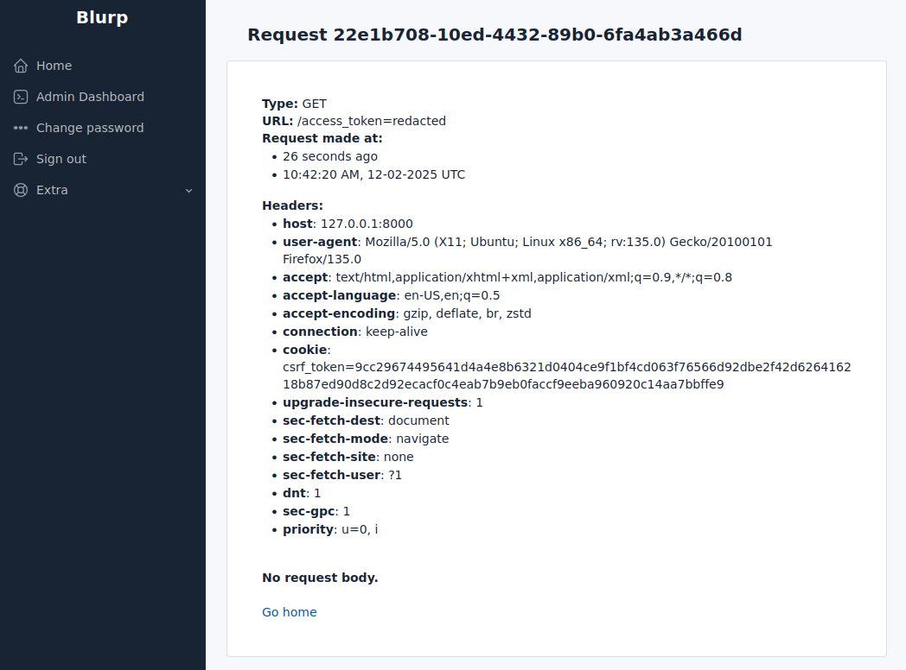

Blurp
---

**SSRF all the things** 

---

Blurp is a simple site that diligently logs all incoming traffic for review. Useful for tracking SSRF callouts, etc.

This is currently live at: https://blurp.skelmis.co.nz

Some example requests:

### Configuration

The following environment variables can be set to modify behaviour:
- `PORT`: The port to serve the server on, defaults to `2300`
- `SERVING_DOMAIN`: A comma seperated string denoting expected hosts for this site
- `HIDE_QUERY_PARAMS`: Setting this to any value will hide query parameters on the home page
- `HIDE_URLS`: Setting this will hide URL's on the home page and instead only show timestamps
- `ONLY_SHOW_CURRENT_DOMAIN`: Setting this value means only requests to the current domain are shown
- `REQUIRE_AUTH`: Set this configuration to require auth to view requests
- `IGNORE_FROM_SELF`: If set, don't log requests made from authed users

### Initial Setup

- Make a copy of `docker-compose.yml`
- Modify all the passwords and environment variables to your liking
- Deploy it with `docker compose up -d`
- Point your domains at the site
- Point your reverse proxy at the deployed port
- Create a new superuser using `poetry run piccolo user create` in the docker shell
  - Tick yes to all three provided options