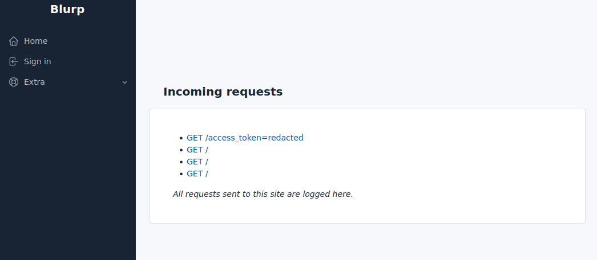

Blurp
---

**SSRF all the things** 

---

Blurp is a simple site that diligently logs all incoming traffic for review. Useful for tracking SSRF callouts, etc.

This is currently live at: https://blurp.skelmis.co.nz

Some example requests:

*N.b. Viewing requests will always prompt for basic auth. If not configured however, the username and password can be left blank*

##### Configuration

The following environment variables can be set to modify behaviour:
- `HIDE_QUERY_PARAMS`: Setting this to any value will hide query parameters on the home page
- Set both of the following to enforce a password when viewing request values:
  - `REQUEST_USERNAME`: The username for basic auth
  - `REQUEST_PASSWORD`: The password for basic auth